# Introducción

Este manual describe el funcionamiento del **panel de administración de Terralia** (`admin.terralia.es`), la herramienta interna que el equipo utiliza para coordinar trabajos, validar usuarios y gestionar el contenido publicado en la aplicación.

El panel está pensado para usarse desde un ordenador con navegador moderno (Chrome, Safari o Firefox actualizados). Todas las acciones que se realizan en él se reflejan en tiempo real en la app móvil de los usuarios.

## A quién va dirigido este manual

Personas del equipo Terralia que coordinan los trabajos de la plataforma:

- Validan registros de nuevos usuarios y de su maquinaria.
- Aprueban o rechazan los trabajos antes de que se publiquen.
- Coordinan vía teléfono o WhatsApp el contacto entre solicitante y proveedor cuando un trabajo se asigna.
- Moderan las valoraciones que los usuarios se dejan entre sí.
- Consultan métricas de uso de la plataforma.

## Estructura del panel

El panel está dividido en seis secciones, accesibles desde el menú lateral izquierdo:

- **Dashboard** — vista general con métricas clave y elementos pendientes de aprobación.
- **Trabajos** — listado y detalle de todos los trabajos publicados.
- **Usuarios** — listado y detalle de todos los usuarios registrados.
- **Maquinaria** — listado y detalle de la maquinaria registrada.
- **Reseñas** — listado y detalle de las valoraciones entre usuarios.
- **Reportes** — métricas y estadísticas agregadas.

\newpage

# Acceso al panel

## Pantalla de inicio de sesión

Para acceder, abre la URL `https://admin.terralia.es` en el navegador. Verás esta pantalla:

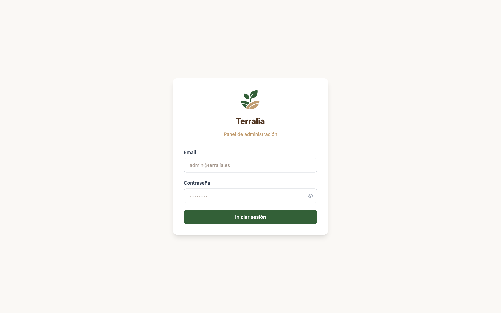

Introduce el correo electrónico y la contraseña que el equipo te haya facilitado.

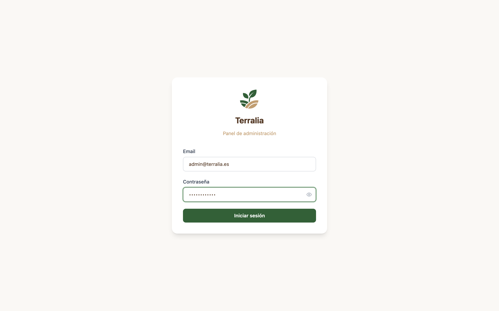

Pulsa el botón verde **Iniciar sesión**.

> **Importante:** las credenciales del panel son personales. No las compartas. Si crees que tu contraseña ha quedado expuesta, comunícalo al responsable técnico para que la regenere.

## Si las credenciales son incorrectas

Si te equivocas, verás el mensaje **Credenciales inválidas** debajo del campo de contraseña. Comprueba que:

- El correo está bien escrito (sin espacios al final).
- No tienes activado el bloqueo de mayúsculas en la contraseña.
- Estás usando la contraseña actual (no una antigua).

\newpage

# Dashboard

Tras iniciar sesión, la primera pantalla que verás es el **Dashboard**. Es la vista principal del panel y está pensada para que, de un vistazo, puedas saber el estado general de la plataforma y qué tareas tienes pendientes.

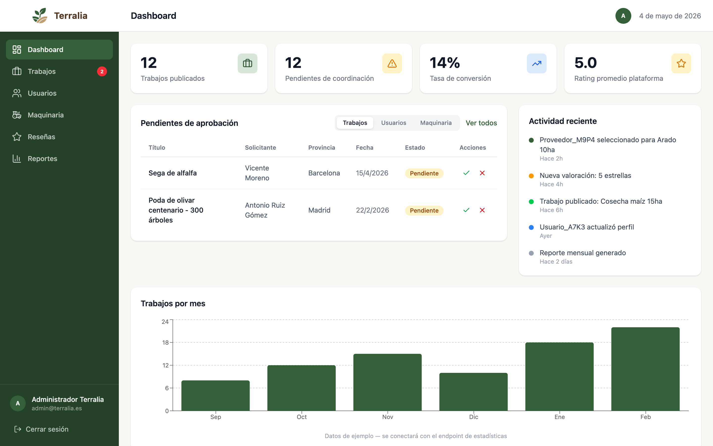

## Métricas superiores

En la parte superior aparecen cuatro tarjetas con las métricas más relevantes del momento:

- **Trabajos publicados** — número total de trabajos publicados en la plataforma.
- **Pendientes de coordinación** — trabajos que están esperando que el equipo coordine el contacto entre las dos partes.
- **Tasa de conversión** — porcentaje de trabajos publicados que terminan completándose con éxito.
- **Rating promedio plataforma** — nota media de todas las valoraciones que se han dejado entre usuarios.

## Pendientes de aprobación

En el centro del dashboard tienes un bloque con tres pestañas: **Trabajos**, **Usuarios** y **Maquinaria**. Cada pestaña muestra los elementos que están esperando tu revisión para ser aprobados o rechazados.

Desde esta tabla puedes:

- **Aprobar** un elemento pulsando el icono verde de validación.
- **Rechazar** un elemento pulsando el icono rojo (la X).
- **Ver el detalle** completo pulsando sobre la fila.

> Las pestañas **Usuarios** y **Maquinaria** te llevan directamente a sus secciones correspondientes filtrando por elementos pendientes.

## Actividad reciente

La columna de la derecha muestra las últimas acciones que han ocurrido en la plataforma: nuevos trabajos, valoraciones, asignaciones y actualizaciones de perfil. Se actualiza automáticamente cada vez que recargas la página.

## Gráfico de trabajos por mes

En la parte inferior tienes el gráfico de barras con la evolución de trabajos publicados en los últimos meses. Sirve para detectar de un vistazo si hay temporadas con más actividad o caídas inesperadas.

\newpage

# Gestión de Trabajos

La sección de **Trabajos** es la que más vas a usar en el día a día. Desde aquí ves todos los trabajos publicados, filtras por estado y entras al detalle para coordinar.

## Listado de trabajos

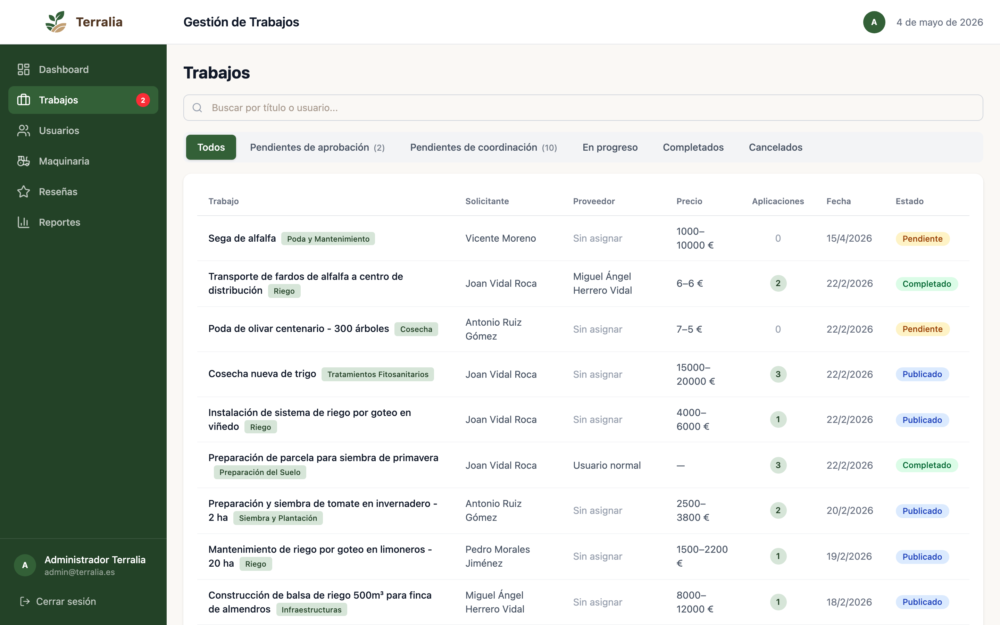

El listado muestra una fila por cada trabajo con la información esencial:

- **Trabajo** — título y categoría (poda, cosecha, riego, etc.).
- **Solicitante** — usuario que ha publicado el trabajo.
- **Proveedor** — usuario asignado para realizarlo, o "Sin asignar" si aún no se ha seleccionado.
- **Precio** — rango de precio propuesto por el solicitante.
- **Aplicaciones** — número de proveedores que se han ofrecido para hacer el trabajo.
- **Fecha** — cuándo se publicó.
- **Estado** — situación actual: Pendiente, Publicado, En progreso, Completado, Cancelado.

### Buscar trabajos

En la parte superior tienes un buscador. Puedes filtrar por **título del trabajo** o por **nombre del solicitante**.

### Filtrar por estado

Las pestañas justo encima del listado te permiten filtrar por estado:

- **Todos** — muestra todos los trabajos sin filtrar.
- **Pendientes de aprobación** — trabajos que esperan tu validación antes de publicarse.
- **Pendientes de coordinación** — trabajos asignados pero a los que aún no has llamado para coordinar.
- **En progreso** — trabajos que ya han sido coordinados y se están realizando.
- **Completados** — trabajos finalizados con éxito.
- **Cancelados** — trabajos que se han anulado.

> El número entre paréntesis junto al nombre de la pestaña es la cantidad de trabajos en ese estado en ese momento.

\newpage

## Detalle de un trabajo

Pulsando sobre cualquier fila del listado entras al detalle:

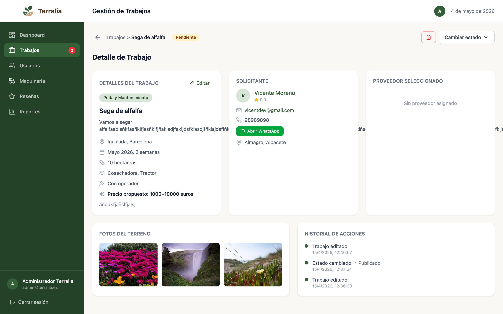

La pantalla está dividida en bloques:

### Detalles del trabajo

Toda la información que el solicitante ha publicado: descripción, ubicación, fechas, superficie en hectáreas, maquinaria solicitada, si requiere operador y rango de precio. Pulsando **Editar** puedes modificar cualquier campo.

> **Importante:** si editas un trabajo que ya estaba publicado, vuelve a estado **Pendiente** y todas las candidaturas existentes se cancelan. Solo edita si es estrictamente necesario.

### Solicitante

Datos reales de la persona que ha publicado el trabajo: nombre, email, teléfono y ubicación. Aquí también tienes el botón verde **Abrir WhatsApp** que prepara un chat con su número, listo para enviar mensaje.

### Proveedor seleccionado

Cuando el trabajo todavía no tiene proveedor asignado, este bloque aparece vacío. Cuando ya hay alguien asignado, muestra los datos reales del proveedor con su botón de **Abrir WhatsApp**.

### Cambiar estado

Arriba a la derecha tienes el botón **Cambiar estado**. Lo usas para mover el trabajo entre los distintos estados (Publicado, En progreso, Completado, Cancelado, etc.) según vayas coordinando.

### Eliminar trabajo

El botón rojo de papelera (arriba a la derecha) elimina el trabajo de forma permanente. Úsalo solo para casos como contenido inapropiado o duplicados claros.

### Fotos del terreno

Si el solicitante ha subido fotos al publicar el trabajo, aparecen en una galería en la parte inferior. Pulsa sobre cualquiera para verla a tamaño completo.

### Historial de acciones

En la parte inferior derecha tienes la lista de cambios del trabajo: cuándo se publicó, cuándo se cambió el estado, ediciones, etc. Es útil para auditar quién hizo qué y cuándo.

\newpage

# Gestión de Usuarios

La sección de **Usuarios** muestra todas las personas registradas en Terralia y permite revisar su actividad, aprobar nuevos perfiles y suspender cuentas si fuera necesario.

## Listado de usuarios

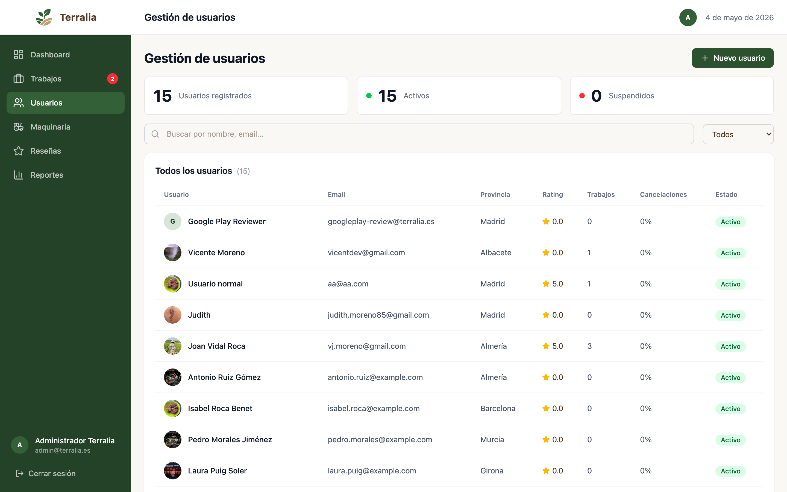

En la parte superior verás tres tarjetas de resumen:

- **Usuarios registrados** — total de cuentas creadas.
- **Activos** — cuentas en uso.
- **Suspendidos** — cuentas bloqueadas por el equipo.

Por cada usuario, el listado muestra:

- **Avatar y nombre** — foto de perfil (si tienen) y nombre real.
- **Email** — correo electrónico.
- **Provincia** — provincia que han indicado en el perfil.
- **Rating** — nota media que les han dejado.
- **Trabajos** — número de trabajos en los que han participado (publicados o realizados).
- **Cancelaciones** — porcentaje de trabajos suyos que han sido cancelados.
- **Estado** — Activo, Suspendido o Pendiente de aprobación.

### Buscar y filtrar

Tienes el buscador para encontrar por nombre o email. El desplegable de la derecha permite filtrar por estado (Activos, Suspendidos, Pendientes…).

### Crear usuario manualmente

El botón verde **+ Nuevo usuario** (arriba a la derecha) abre el formulario para crear una cuenta manualmente desde el panel. Se usa en casos puntuales (por ejemplo, dar de alta a un cliente que no quiere registrarse desde la app).

\newpage

## Detalle de un usuario

Pulsando una fila accedes al perfil completo:

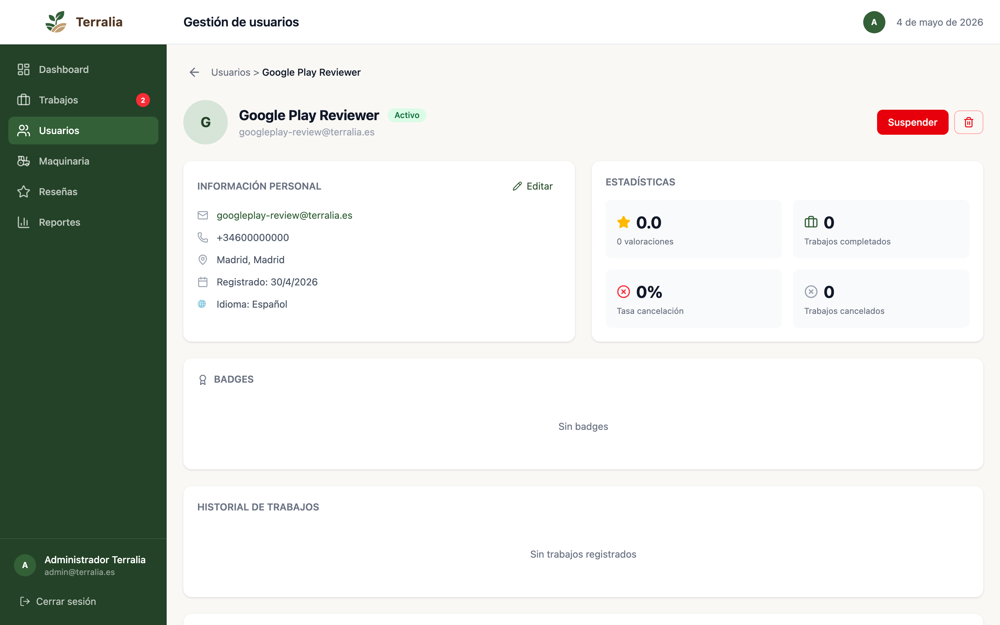

### Información personal

Datos básicos: email, teléfono, ubicación, fecha de registro e idioma. Pulsando **Editar** puedes modificar el nombre, teléfono o cualquier otro dato.

### Estadísticas

Cuatro métricas resumen la actividad del usuario:

- Número de valoraciones recibidas y nota media.
- Trabajos completados.
- Tasa de cancelación.
- Trabajos cancelados.

### Suspender / activar

El botón rojo **Suspender** (arriba a la derecha) bloquea la cuenta: el usuario no podrá iniciar sesión ni publicar nada hasta que se desbloquee. Si el usuario ya está suspendido, el botón cambia a **Activar**.

### Eliminar usuario

El icono de papelera junto a Suspender elimina permanentemente la cuenta y anonimiza todos sus datos personales. Es una acción **irreversible**: úsala solo si el usuario lo solicita expresamente o por motivos legales.

### Badges

El bloque **Badges** muestra los reconocimientos automáticos que el usuario ha conseguido por su actividad (proveedor verificado, agricultor activo, etc.). Estos se asignan automáticamente — desde aquí puedes consultarlos pero no editarlos.

### Historial de trabajos

En la parte inferior tienes el listado completo de todos los trabajos en los que el usuario ha intervenido, ya sea como solicitante o como proveedor.

\newpage

# Gestión de Maquinaria

Cada usuario puede registrar la maquinaria de la que dispone (tractores, cosechadoras, atomizadores, etc.). Esa maquinaria es lo que aparece cuando aplican a un trabajo. La sección **Maquinaria** te permite revisarla y aprobarla.

## Listado de maquinaria

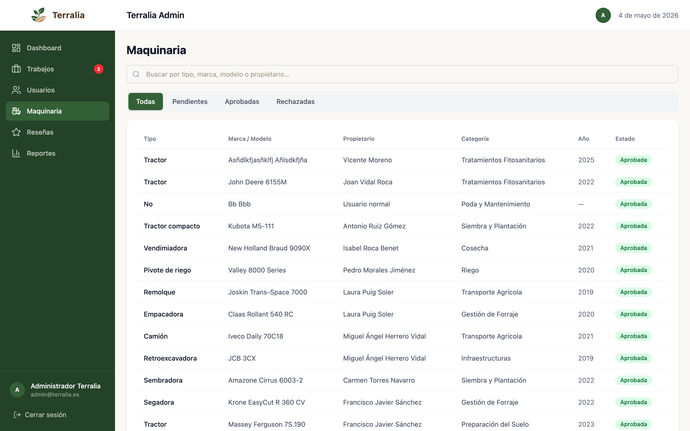

El listado muestra:

- **Tipo de máquina** y **categoría**.
- **Marca y modelo**.
- **Año** de fabricación.
- **Propietario** — usuario que la ha registrado.
- **Estado de aprobación**.

### Aprobar maquinaria

Cada vez que un usuario añade una máquina nueva, aparece como **Pendiente de aprobación**. Tu trabajo aquí es revisar las fotos y especificaciones que ha subido y decidir si validas la máquina o pides al usuario que la corrija.

\newpage

## Detalle de una máquina

Pulsando una fila accedes a la ficha completa:

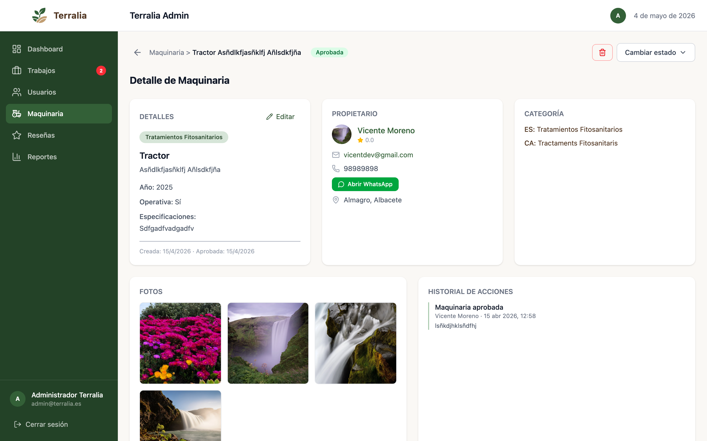

Verás:

- **Datos técnicos** — marca, modelo, año, especificaciones que ha indicado el propietario.
- **Categoría** — qué tipo de servicios puede ofrecer con esta máquina.
- **Propietario** — usuario al que pertenece, con acceso directo a su perfil.
- **Fotos** — imágenes que el usuario ha subido.
- **Estado operativo** — si está activa o no.

Desde aquí puedes **Aprobar**, **Rechazar** o **Editar** la maquinaria.

\newpage

# Gestión de Reseñas

Cuando un trabajo se completa, tanto el solicitante como el proveedor pueden valorarse mutuamente con una nota de 1 a 5 estrellas y un comentario. Estas valoraciones pasan primero por revisión del equipo antes de hacerse públicas.

## Listado de reseñas

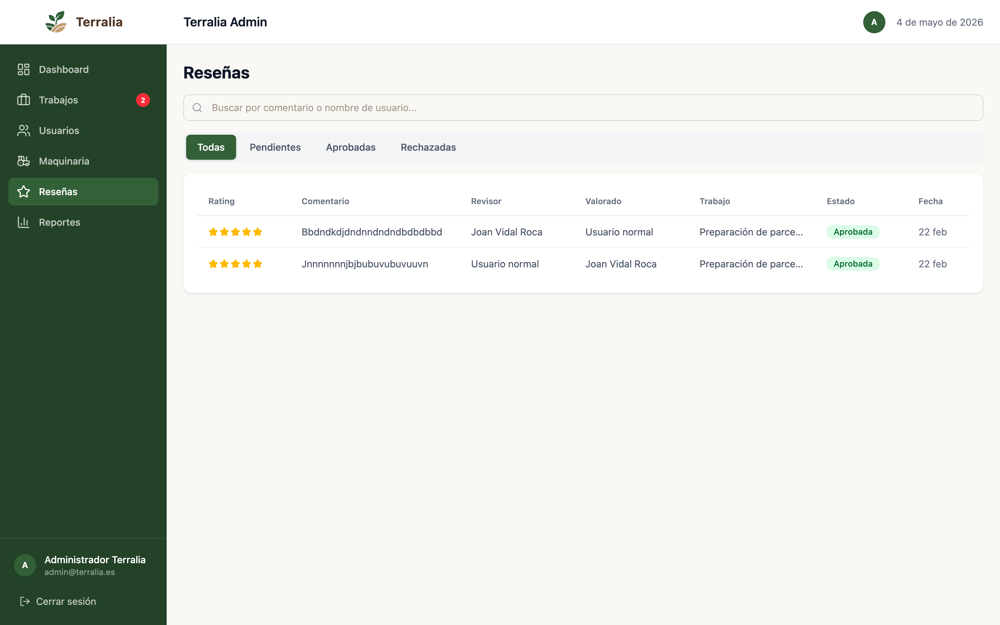

En la lista verás cada valoración con:

- **Revisor** — quién la ha dejado.
- **Usuario valorado** — a quién va dirigida.
- **Estrellas** — nota.
- **Comentario** — texto.
- **Trabajo asociado** — al que se refiere.
- **Estado** — Pendiente, Aprobada o Rechazada.

### Filtrar reseñas

Las pestañas superiores te permiten filtrar por estado (todas, pendientes, aprobadas, rechazadas) y el buscador filtrar por usuario o por contenido del comentario.

\newpage

## Detalle de una reseña

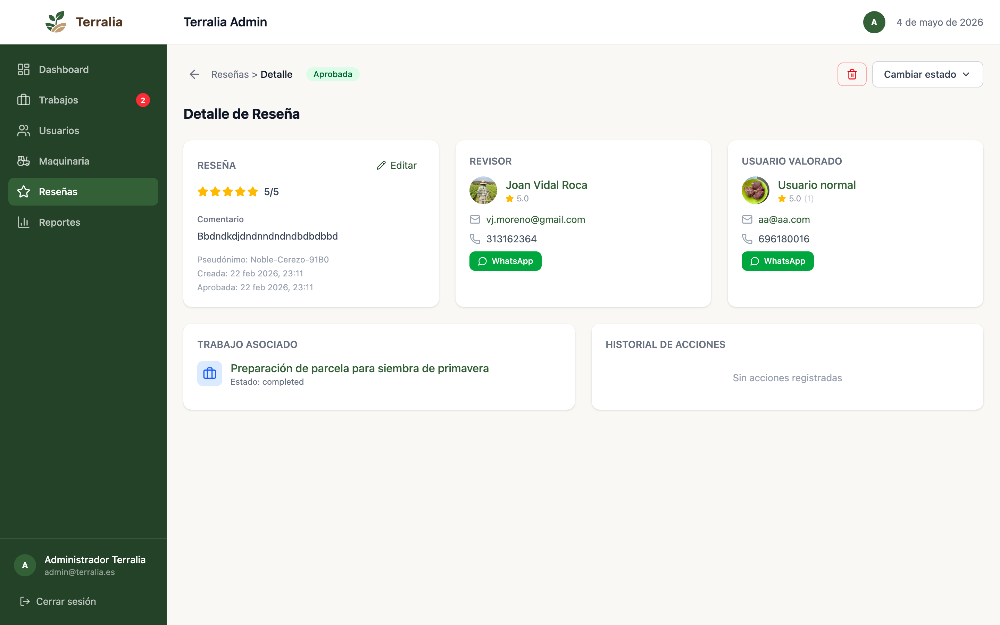

Desde el detalle puedes:

- **Aprobar** la reseña → se hace pública en el perfil del usuario valorado.
- **Rechazar** la reseña → no se publica y se notifica al revisor.
- **Editar** el comentario → si tiene una falta de ortografía menor, puedes corregirla antes de aprobar.
- **Eliminar** la reseña.

> **Cuándo rechazar:** insultos, acusaciones sin pruebas, datos personales (teléfonos, direcciones) en el comentario, o cualquier contenido que viole las normas de la comunidad.

El bloque **Trabajo asociado** te lleva al trabajo concreto al que se refiere la valoración, por si necesitas comprobar el contexto. **Historial de acciones** registra todas las modificaciones que se han hecho sobre la reseña.

\newpage

# Reportes

La sección **Reportes** muestra estadísticas agregadas de la plataforma. Es la pantalla que más utilidad tiene para reuniones de seguimiento, informes mensuales o detectar tendencias.

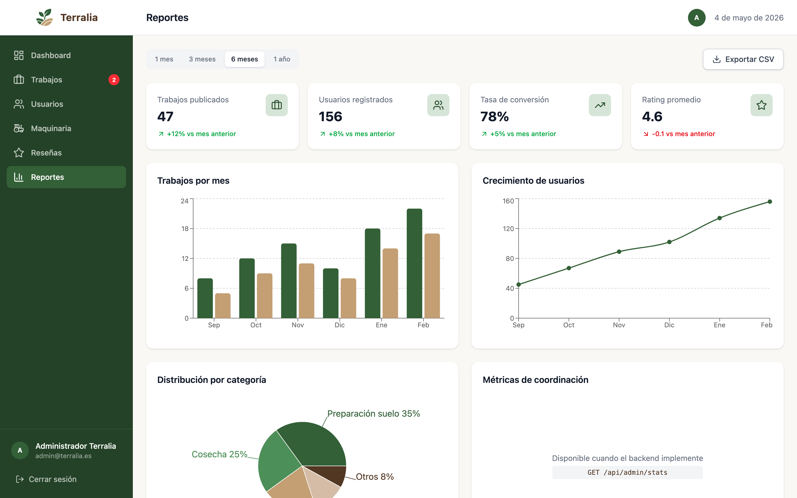

## Selector de periodo

Arriba a la izquierda tienes los botones de periodo: **1 mes**, **3 meses**, **6 meses** y **1 año**. Todas las gráficas y métricas se actualizan al cambiar el periodo.

## Métricas principales

Las cuatro tarjetas muestran:

- **Trabajos publicados** en el periodo, con la variación porcentual respecto al periodo anterior.
- **Usuarios registrados** nuevos.
- **Tasa de conversión** (trabajos completados sobre publicados).
- **Rating promedio** de las valoraciones del periodo.

> Las flechas verdes / rojas indican si el indicador ha mejorado o empeorado respecto al periodo anterior.

## Gráficos

- **Trabajos por mes** — barras dobles que comparan publicados vs completados cada mes.
- **Crecimiento de usuarios** — línea con la evolución acumulada.
- **Distribución por categoría** — porcentajes de trabajos por tipo de servicio.
- **Métricas de coordinación** — tiempos medios desde publicación hasta asignación, y desde asignación hasta completado.

## Exportar a CSV

El botón **Exportar CSV** (arriba a la derecha) descarga todas las métricas del periodo seleccionado en formato hoja de cálculo. Útil para informes mensuales o análisis externos.

\newpage

# Casos de uso típicos

A continuación, los flujos más habituales del día a día.

## Caso 1: Validar un nuevo usuario

1. Entra al **Dashboard**.
2. En **Pendientes de aprobación**, pulsa la pestaña **Usuarios**.
3. Pulsa sobre la fila del usuario que quieras revisar.
4. Comprueba que la **información personal** está completa y es coherente (nombre real, ubicación que cuadra con su provincia, etc.).
5. Si todo está bien, pulsa **Aprobar** desde el botón verde de la cabecera.
6. Si falta información, pulsa **Rechazar** y el usuario recibirá una notificación pidiéndole completar los datos.

## Caso 2: Coordinar un trabajo recién asignado

1. Entra a **Trabajos** → pestaña **Pendientes de coordinación**.
2. Pulsa la fila del trabajo a coordinar.
3. En el bloque **Solicitante**, pulsa **Abrir WhatsApp** para contactar a la primera parte.
4. Confirma fechas exactas y precio final.
5. Repite con el bloque **Proveedor seleccionado**: pulsa su **Abrir WhatsApp** y comunícale los datos acordados.
6. Cuando ambos confirmen, pulsa **Cambiar estado → En progreso**.

## Caso 3: Aprobar una valoración

1. Entra a **Reseñas** → pestaña **Pendientes**.
2. Pulsa sobre la valoración que quieras revisar.
3. Lee el comentario y la nota.
4. Si el contenido es legítimo, pulsa **Aprobar**.
5. Si tiene insultos, datos personales o acusaciones sin pruebas, pulsa **Rechazar**.
6. Si solo necesita corregir una falta de ortografía menor, pulsa **Editar**, corrígela y luego **Aprobar**.

## Caso 4: Marcar un trabajo como completado

1. Entra a **Trabajos** → pestaña **En progreso**.
2. Pulsa sobre el trabajo a cerrar.
3. Pulsa **Cambiar estado → Completado**.
4. Ambas partes recibirán una notificación pidiéndoles dejar valoración.

## Caso 5: Suspender una cuenta problemática

1. Entra a **Usuarios** y busca al usuario por nombre o email.
2. Pulsa sobre su fila.
3. Pulsa el botón rojo **Suspender** arriba a la derecha.
4. El usuario no podrá iniciar sesión hasta que un administrador lo reactive.

\newpage

# Cerrar sesión

Cuando termines tu turno, cierra sesión para evitar accesos no autorizados.

En la parte inferior izquierda del menú lateral, debajo de tu nombre y correo, está el enlace **Cerrar sesión**. Pulsa sobre él y volverás a la pantalla de login.

> **Buena práctica:** si vas a dejar el ordenador desatendido, cierra sesión aunque sean unos minutos. El panel contiene datos personales de los usuarios.

---

# Resumen de buenas prácticas

- **Revisa el dashboard al empezar la jornada** — los pendientes te dicen las prioridades del día.
- **Usa siempre los botones específicos** (Aprobar, Rechazar, Cambiar estado) en lugar de editar directamente desde formularios.
- **Documenta en el historial** lo que haces — todas tus acciones quedan registradas en la sección de historial de cada elemento.
- **No edites trabajos publicados sin necesidad** — al editarlos vuelven a Pendiente y las candidaturas se cancelan.
- **Cierra sesión** al terminar la jornada o si dejas el ordenador.
- **No compartas tus credenciales** — son personales e intransferibles.

---

*Si encuentras algún error en el panel, alguna funcionalidad que no responde como debería o tienes sugerencias de mejora, comunícalo al responsable técnico para que se incorpore en próximas versiones.*
